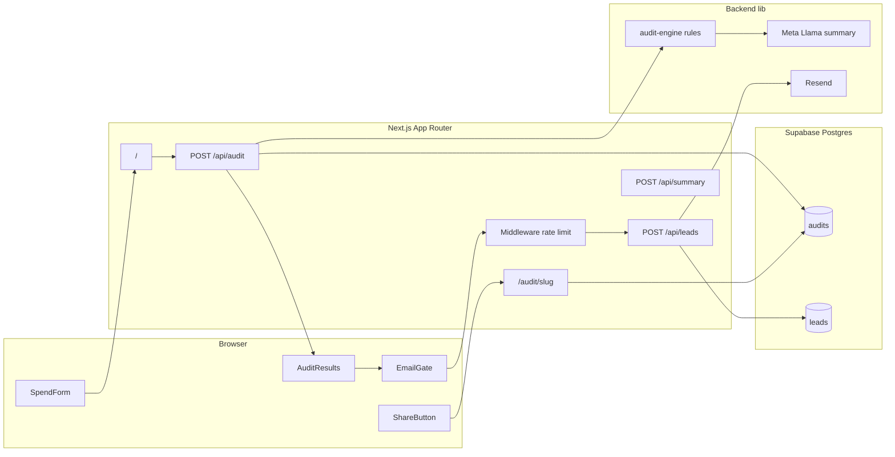

# Architecture — SpendLens

## System diagram

## Data flow (happy path)

1. User fills **SpendForm** (8 tools, persisted in `localStorage`).
2. **POST /api/audit** validates with Zod, runs deterministic **audit-engine** (no LLM for math).
3. **Meta API** generates ~100-word summary (8s timeout, templated fallback).
4. Audit **input**, **result**, and **summary** saved to Supabase → `slug` returned.
5. **AuditResults** renders on home; **EmailGate** shown after value.
6. **POST /api/leads** (rate-limited in middleware) saves lead + sends Resend email.
7. **GET /audit/[slug]** loads public-safe JSON (no email/company from leads).

## Stack choices

| Layer | Choice | Why |
|-------|--------|-----|
| Framework | **Next.js 14** App Router | Single deploy for UI + API routes; SSR for share pages + OG metadata |
| UI | **Tailwind + shadcn/ui** | Fast, accessible primitives; no page-builder lock-in |
| Validation | **Zod** | Shared schemas for API + types |
| Database | **Supabase (Postgres)** | JSONB for audit payloads; RLS-ready; simple Vercel pairing |
| Email | **Resend** | Transactional email with minimal setup |
| AI | **Meta Llama API** | Assignment requires LLM for summary only; audit rules stay deterministic |
| Hosting | **Vercel** | Zero-config Next.js, edge middleware for rate limits |

## Folder layout

- `app/` — routes and API (Next.js requirement)
- `frontend/components/` — UI
- `backend/lib/` — audit engine, Supabase, email, validators
- `database/supabase/` — SQL schema
- `shared/types/` — TypeScript contracts

## Security

- Secrets in environment variables only (`.env.local` / Vercel env).
- **Service role** key used server-side only for inserts/reads.
- **Honeypot** on lead form; silent success for bots.
- **Rate limit** on `/api/leads`: 5 POSTs per IP per hour (in-memory middleware).
- Share pages strip PII — only tool spend and recommendations.

## Scaling to ~10k audits/day

| Bottleneck | Mitigation |
|------------|------------|
| Audit CPU | Rules are O(tools)—cheap; stateless horizontal scale on Vercel |
| Meta API latency | Already non-blocking with timeout + fallback; queue summary job if needed |
| Postgres writes | Indexes on `slug`, `created_at`, `is_high_value` (in schema) |
| Hot reads for share URLs | Add CDN cache on `/audit/[slug]` (`revalidate` 60s) or read replica |
| Rate limiting | Move middleware bucket to **Upstash Redis** for multi-region |
| Email | Resend batching; async worker for lead emails |

At MVP scale, Vercel + Supabase free/pro tiers are sufficient. First upgrade would be Redis rate limits + cached share pages.

## Key trade-offs (see README)

Hardcoded audit rules build trust; LLM only for narrative summary. In-memory rate limit assumes single-region MVP traffic.
